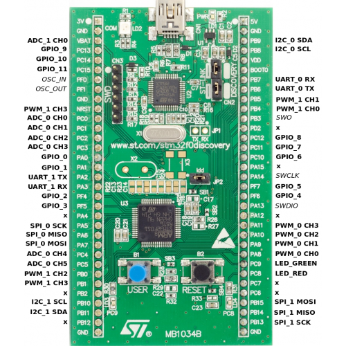

# Overview

Riga board is based on STM32F0Discovery with **STM32F051R8T6**.
It also includes an ST-LINK/V2 based on STM32F103C8T6.

Quick facts about STM32F051R8T6:
* Flash memory 32KBytes
* SRAM 8KBytes
* Max CPU frequency 48MHz
* Package LQFP64
* Peripherals: 
    * Communications 2x USART, 1x I2C, 2x SPI, 1x CEC  
    * Timers
    * Analog

***
# Connections

## Pinouts

| pin | type | description |
| --- | --- | --- |
| PA2 | in | USART2-RX, console FT232 |
| PA3 | out | USART2-TX, console FT232 |
| PC8 | out | LED (LD4), blue, active high |
| PC9 | out | LED (LD3), green, active low |

***
# L298N - stepper motor driver
2 bridges or 4 half-bridges.

***
